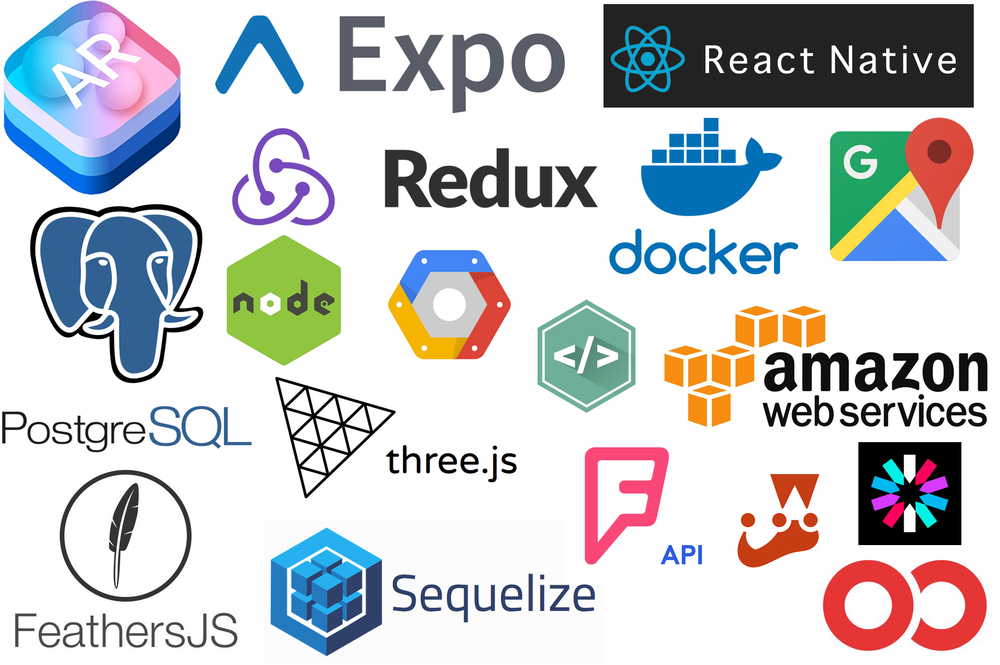

# Odycity


## About Odycity

### Odycity makes it fun to explore your city by making it easy and fun to find what is happening around you.

Odycity makes it easy to start your odyssey on Android or iOS. By using a location of their choice the user can find restaurants,
bars, museums, live music, local shopping, and art venues all within walking distance. 
Pick and choose what interests you and we will plot the best route. And if our users are feeling adventurous, they can choose a premade journey with each destination being a surpise.

However you decide on your journey be sure to share every memory by uploading your photos of each destination.

## Table of Contents

1. [What is Odycity?](#about-odycity)
1. [Team](#team)
1. [Wireframes](#wireframes)
1. [Tech Stack](#tech-stack)
1. [Database Schema](#database-schema)
1. [Development](#development)
    1. [Requirements](#requirements)
    1. [Installing Dependencies](#installing-dependencies)

## Team 
  - __Product Owner__: Aaron Matheney
  - __Scrum Master__: Violet Suber
  - __Development Team Members__: Jake Pepple, Aaron Matheney, Violet Suber

## Wireframes 


## Tech Stack 

### Summary of Tech Stack
* Front End: React-Native, Redux, Three.js, Expo
* Server: FeathersJS, Sequelize, Passport
* Database: PostgreSQL
* Deployment: Docker, Amazon Web Services, Google Cloud Platform
* Testing: Jest

## Database Schema 


## Development

### Requirements
- Node.js 8.1.4
- NPM 5.0.3
- PostgreSQL 9.6

### Installing Dependencies

From within the root directory:
```bash
$ npm install -g React-native
$ npm install
```
To start front end run:
```bash
$ react-native run-android
$ react-native run-ios
```
## Contributing 
